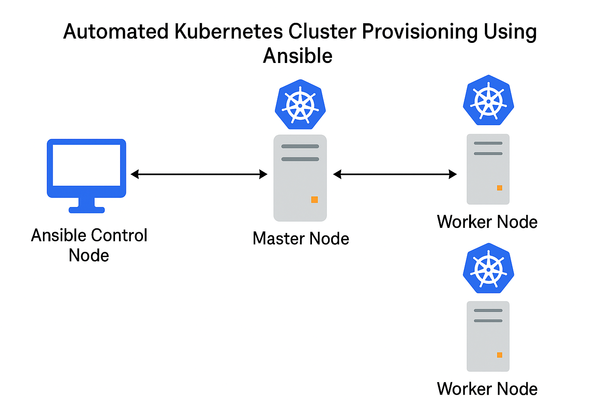

# Automated Kubernetes Cluster Provisioning Using Ansible

This project automates the setup of a Kubernetes cluster using Ansible. It provisions a single master node and multiple worker nodes, installs required components, initializes the master, and joins the workers to form a functioning Kubernetes cluster.

---



---

## 📁 Project Structure

```bash
k8s-ansible-cluster/
├── inventory.ini # Inventory file with master and worker nodes
├── site.yml # Main playbook file
└── roles/
├── common/ # Common prerequisites (curl, apt, etc.)
├── docker/ # Installs Docker
└── kubernetes/ # Installs K8s tools and initializes cluster

# ===============================
# >> THE STRUCTURE INCLUDES <<
# ===============================

k8s-ansible-cluster/
├── inventory.ini
├── site.yml
└── roles/
    ├── common/
    │   └── tasks/main.yml
    ├── docker/
    │   └── tasks/main.yml
    └── kubernetes/
        └── tasks/main.yml
        
```

---

## 🧰 Prerequisites

- Ubuntu 20.04 or later on all nodes
- Ansible installed on control machine
- SSH access to all nodes with a user that has sudo privileges
- Passwordless `sudo` recommended
- Internet access on all nodes

---

## 📦 Required Packages

On the control machine (your Ansible node), install:

```bash
sudo apt update
sudo apt install -y ansible sshpass
```

---

## 📦 Running the Playbook

1. Test SSH Access (optional but recommended)
```bash   
ansible -i inventory.ini all -m ping
```

2. Run the Playbook
```bash
ansible-playbook -i inventory.ini site.yml
```

=> This playbook will:

Install common packages

Install Docker

Install Kubernetes tools

Initialize Kubernetes on master node

Join worker nodes automatically

3. Post Setup Verification
```bash
kubectl get nodes
```
